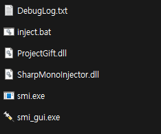

# Lethal_Company_Cheat_Tool-Analysis-Project-Gift-v1.0.1
### 목차
  1. [개요](https://github.com/hbeooooooom/Lethal_Company_Cheat_Tool-Analysis-Project-Gift-v1.0.1?tab=readme-ov-file#1-%EA%B0%9C%EC%9A%94)
     1.1. [전투 및 생존 관련 기능](https://github.com/hbeooooooom/Lethal_Company_Cheat_Tool-Analysis-Project-Gift-v1.0.1?tab=readme-ov-file#11-%EC%A0%84%ED%88%AC-%EB%B0%8F-%EC%83%9D%EC%A1%B4-%EA%B4%80%EB%A0%A8-%EA%B8%B0%EB%8A%A5)
     1.2. [돈 및 아이템 관련 기능](https://github.com/hbeooooooom/Lethal_Company_Cheat_Tool-Analysis-Project-Gift-v1.0.1?tab=readme-ov-file#12-%EA%B2%BD%EC%A0%9C-%EB%B0%8F-%EC%95%84%EC%9D%B4%ED%85%9C-%EA%B4%80%EB%A0%A8-%EA%B8%B0%EB%8A%A5)
     1.3. [비주얼 효과 비활성화](https://github.com/hbeooooooom/Lethal_Company_Cheat_Tool-Analysis-Project-Gift-v1.0.1?tab=readme-ov-file#13-%EB%B9%84%EC%A3%BC%EC%96%BC-%ED%9A%A8%EA%B3%BC-%EB%B9%84%ED%99%9C%EC%84%B1%ED%99%94)
  2. [인젝터(smi.exe)](https://github.com/hbeooooooom/Lethal_Company_Cheat_Tool-Analysis-Project-Gift-v1.0.1?tab=readme-ov-file#2-%EC%9D%B8%EC%A0%9D%ED%84%B0-smiexe)
     2.1. [기본 기능](https://github.com/hbeooooooom/Lethal_Company_Cheat_Tool-Analysis-Project-Gift-v1.0.1?tab=readme-ov-file#21-%EA%B8%B0%EB%B3%B8-%EA%B8%B0%EB%8A%A5)
  3. [사용법](https://github.com/hbeooooooom/Lethal_Company_Cheat_Tool-Analysis-Project-Gift-v1.0.1?tab=readme-ov-file#3-%EC%82%AC%EC%9A%A9%EB%B2%95-injectbat)
  4. [치트 모듈 (ProjectGift.dll) 분석](https://github.com/hbeooooooom/Lethal_Company_Cheat_Tool-Analysis-Project-Gift-v1.0.1?tab=readme-ov-file#4-%EC%B9%98%ED%8A%B8-%EB%AA%A8%EB%93%88-projectgiftdll-%EB%B6%84%EC%84%9D)
     4.1. [주요 클래스](https://github.com/hbeooooooom/Lethal_Company_Cheat_Tool-Analysis-Project-Gift-v1.0.1?tab=readme-ov-file#41-%EC%A3%BC%EC%9A%94-%ED%8C%A8%EC%B9%98-%EC%98%88%EC%8B%9C)
     4.2. [Hacks 패키지](https://github.com/hbeooooooom/Lethal_Company_Cheat_Tool-Analysis-Project-Gift-v1.0.1?tab=readme-ov-file#42-hacks-%ED%8C%A8%ED%82%A4%EC%A7%80)
     4.3. [Possession 패키지](https://github.com/hbeooooooom/Lethal_Company_Cheat_Tool-Analysis-Project-Gift-v1.0.1?tab=readme-ov-file#43-possession-%ED%8C%A8%ED%82%A4%EC%A7%80)   
  5. [SharpmonoInjector.dll 분석](https://github.com/hbeooooooom/Lethal_Company_Cheat_Tool-Analysis-Project-Gift-v1.0.1?tab=readme-ov-file#5-sharpmonoinjectordll)
     5.1. [프로세스 권한 획득 및 런타임 조작](https://github.com/hbeooooooom/Lethal_Company_Cheat_Tool-Analysis-Project-Gift-v1.0.1?tab=readme-ov-file#51-%ED%94%84%EB%A1%9C%EC%84%B8%EC%8A%A4-%EA%B6%8C%ED%95%9C-%ED%9A%8D%EB%93%9D-%EB%B0%8F-%EB%9F%B0%ED%83%80%EC%9E%84-%EC%A1%B0%EC%9E%91)
     5.2. [Injector - 프로세스 이름 대상 찾기](https://github.com/hbeooooooom/Lethal_Company_Cheat_Tool-Analysis-Project-Gift-v1.0.1?tab=readme-ov-file#52-injector---%ED%94%84%EB%A1%9C%EC%84%B8%EC%8A%A4-%EC%9D%B4%EB%A6%84-%EB%8C%80%EC%83%81-%EC%B0%BE%EA%B8%B0)
     5.3. [Inject - DLL 주입 실행](https://github.com/hbeooooooom/Lethal_Company_Cheat_Tool-Analysis-Project-Gift-v1.0.1?tab=readme-ov-file#53-inject---dll-%EC%A3%BC%EC%9E%85-%EC%8B%A4%ED%96%89)
     5.4. [ObtainMonoExports](https://github.com/hbeooooooom/Lethal_Company_Cheat_Tool-Analysis-Project-Gift-v1.0.1?tab=readme-ov-file#54-obtainmonoexports)
     5.5. [GetRootDomain](https://github.com/hbeooooooom/Lethal_Company_Cheat_Tool-Analysis-Project-Gift-v1.0.1?tab=readme-ov-file#55-getrootdomain)
     5.6. [GetImageFromAssembly](https://github.com/hbeooooooom/Lethal_Company_Cheat_Tool-Analysis-Project-Gift-v1.0.1?tab=readme-ov-file#56-getimagefromassembly)
     5.7. [GetClassFromName](https://github.com/hbeooooooom/Lethal_Company_Cheat_Tool-Analysis-Project-Gift-v1.0.1?tab=readme-ov-file#57-getclassfromname)
     5.8. [GetMethodFromName](https://github.com/hbeooooooom/Lethal_Company_Cheat_Tool-Analysis-Project-Gift-v1.0.1?tab=readme-ov-file#58-getmethodfromname)
  6. [핵 개발에 사용된 기능들](https://github.com/hbeooooooom/Lethal_Company_Cheat_Tool-Analysis-Project-Gift-v1.0.1?tab=readme-ov-file#6-%ED%95%B5-%EA%B0%9C%EB%B0%9C%EC%97%90-%EC%82%AC%EC%9A%A9%EB%90%9C-%EA%B8%B0%EB%8A%A5%EB%93%A4)
     6.1. [Harmony 라이브러리](https://github.com/hbeooooooom/Lethal_Company_Cheat_Tool-Analysis-Project-Gift-v1.0.1?tab=readme-ov-file#61-harmony-%EB%9D%BC%EC%9D%B4%EB%B8%8C%EB%9F%AC%EB%A6%AC)
     6.2. [리플렉션](https://github.com/hbeooooooom/Lethal_Company_Cheat_Tool-Analysis-Project-Gift-v1.0.1?tab=readme-ov-file#62-%EB%A6%AC%ED%94%8C%EB%A0%89%EC%85%98)
     6.3. [DLL Injection(SharpMonoInjector)](https://github.com/hbeooooooom/Lethal_Company_Cheat_Tool-Analysis-Project-Gift-v1.0.1?tab=readme-ov-file#63-dll-injectionsharpmonoinjector)
     6.4. [네트워크 프로토콜 조작](https://github.com/hbeooooooom/Lethal_Company_Cheat_Tool-Analysis-Project-Gift-v1.0.1?tab=readme-ov-file#64-%EB%84%A4%ED%8A%B8%EC%9B%8C%ED%81%AC-%ED%94%84%EB%A1%9C%ED%86%A0%EC%BD%9C-%EC%A1%B0%EC%9E%91)
  7. [분석 결과 및 결론](https://github.com/hbeooooooom/Lethal_Company_Cheat_Tool-Analysis-Project-Gift-v1.0.1?tab=readme-ov-file#7-%EB%B6%84%EC%84%9D-%EA%B2%B0%EA%B3%BC-%EB%B0%8F-%EA%B2%B0%EB%A1%A0)
     7.1. [기술적 특징](https://github.com/hbeooooooom/Lethal_Company_Cheat_Tool-Analysis-Project-Gift-v1.0.1?tab=readme-ov-file#71-%EA%B8%B0%EC%88%A0%EC%A0%81-%ED%8A%B9%EC%A7%95)
     7.2. [보안 측면](https://github.com/hbeooooooom/Lethal_Company_Cheat_Tool-Analysis-Project-Gift-v1.0.1?tab=readme-ov-file#72-%EB%B3%B4%EC%95%88-%EC%B8%A1%EB%A9%B4)
     7.3. [기능 범위](https://github.com/hbeooooooom/Lethal_Company_Cheat_Tool-Analysis-Project-Gift-v1.0.1?tab=readme-ov-file#73-%EA%B8%B0%EB%8A%A5-%EB%B2%94%EC%9C%84)

     
# **1. 개요**

이 분석은 리썰 컴퍼니(Lethal Company) 게임용 치트 프로그램의 구성 요소와 작동 원리를 분석한 내용입니다. 주요 구성 요소는 `SharpMonoInjector.dll` (인젝터)와 `ProjectGift.dll` (실제 치트 모듈)로 구성되어 있습니다.



## 1.1. 전투 및 생존 관련 기능

- AntiKickPatch - 추방 방지
- GodMode - 다양한 사망 원인으로부터 보호
- PlayerControllerB_AllowPlayerDeath_Patch - 사망 처리 제어

## 1.2. 돈 및 아이템 관련 기능

- CostFixForSprayPaint - 모든 아이템 무료화
- UnlockablePriceChange - 언락 아이템 가격 조절

## 1.3. 비주얼 효과 비활성화

- Bloom_IsActive_Patch - 블룸 효과 비활성화(밝은 부분이 번져 보이는 효과)
- DepthOfField_IsActive_Patch - 피사계 심도 비활성화(초점 맞지 않은 부분이 흐려지는 효과)
- FilmGrain_IsActive_Patch - 필름그레인 비활성화(필름 질감 같은 노이즈 효과)
- Vignette_IsActive_Patch - 비네트 효과 비활성화(화면 가장자리가 어두워지는 효과)
- NoFlash_Patch - 플래시 방지(플래시뱅이나 번개 같은 번쩍임 방지)

# 2. 인젝터 (smi.exe)

- 관리자 권한을 확인

```c
if (!new WindowsPrincipal(WindowsIdentity.GetCurrent()).IsInRole(WindowsBuiltInRole.Administrator))
{
    Console.WriteLine("WARNING: You are running this in an unpriveleged process...");
}
```

- 안티 바이러스 탐지 - 우회 기능은 존재하지 않음

```c
if (Program.AntivirusInstalled())
{
    Console.WriteLine("!!! WARNING ANTIVIRUS DETECTED !!! CHECK DEBUG.LOG FOR RUNNING PROCESS.");
}
```

- 명령줄 인자 파싱

```c
CommandLineArguments commandLineArguments = new CommandLineArguments(args);
bool flag = commandLineArguments.IsSwitchPresent("inject");   // 주입 모드
bool flag2 = commandLineArguments.IsSwitchPresent("eject");   // 제거 모드
```

## 2.1. 기본 기능

- -p : 프로세스 ID/이름
- -a : DLL 경로 또는 주소
- -n : 네임 스페이스
- -c : 클래스명
- -m : 메소드명

# 3. 사용법 (inject.bat)

`smi.exe inject -p "Lethal Company" -a ProjectGift.dll -n ProjectGift -c Loader -m Init`

- 인젝터는 직접 개발한 것이 아닌 것으로 추측. 혹은 여러 게임의 핵을 돌리기 위해 개발

# 4. 치트 모듈 (ProjectGift.dll) 분석

## 4.1. 주요 클래스

```c
// AntiKickPatch
// Bloom_IsActive_Patch
// CostFixForSprayPaint
// DepthOfField_IsActive_Patch
// Exposure_IsActive_Patch
// FilmGrain_IsActive_Patch
// Fog_IsFogEnabled_Patch
// Fog_IsPBRFogEnabled_Patch
// Fog_IsVolumetricFogEnabled_Patch
// GodMode
// GrabbableObject_DestroyObjectInHand_Patch
// GrabbableObject_RequireCooldown_Patch
// InteractTrigger_Interact_Patch
// Jump_performed_Patch
// Jump_performed_Patch_Speed
// NoFlash_Patch
// PatcherTool_LateUpdate_Patch
// Patches
// PlayerControllerB_AllowPlayerDeath_Patch
// PlayerControllerB_CheckConditionsForEmote_Patch
// PlayerControllerB_PlayerHitGroundEffects_Patch
// Render
// ShipBuildModeManager_PlayerMeetsConditionsToBuild_Patch
// ShotgunItem_ItemActivate_Patch
// SpectateNextPlayer_Patch
// StartOfRound_UpdatePlayerVoiceEffects_Patch
// SteamLobbyManager_RefreshServerListButton_Patch
// StunGrenadeItem_ItemActivate_Patch
// UnlockablePriceChange
// Vignette_IsActive_Patch
```

### 4.1.1. AntiKickPatch

- 추방 방지하는 기능

```c
using System;
using GameNetcodeStuff;
using HarmonyLib;
using ProjectGift;
using Steamworks;

namespace Patches
{
	// Token: 0x0200001A RID: 26
	[HarmonyPatch(typeof(PlayerControllerB), "SendNewPlayerValuesServerRpc")]
	internal class AntiKickPatch
	{
		// Token: 0x06000051 RID: 81 RVA: 0x00004280 File Offset: 0x00002480
		private static bool Prefix(PlayerControllerB __instance)
		{
			bool flag = !Settings.Instance.b_AntiKick; // not (!) 붙어있음
			bool result;
			//안티킥 한수가 비활성화 되어 있으면
			if (flag)
			{
				result = true; //원래 함수를 계속 실행
			}
			else//안티킥 함수 활성화 되어 있으면
			{
				ulong[] array = new ulong[__instance.playersManager.allPlayerScripts.Length];
				
				for (int i = 0; i < __instance.playersManager.allPlayerScripts.Length; i++)
				{
					array[i] = __instance.playersManager.allPlayerScripts[i].playerSteamId;
					//array에 해당 방에 있는 모든 유저들의 id를 수집
				}
				array[(int)(checked((IntPtr)__instance.playerClientId))] = SteamClient.SteamId;
				result = false;
			}
			return result;
		}
	}
}

```

- PlayerControllerB.SendNewPlayerValuesServerRPC 함수를 가로채서 수정
- 해당 함수는 플레이어의 상태값을 서버에 전송하는 역할을 함

- __instance : 현재 실행중인 PlayerControllerB 객체
- playerManager : 게임의 플레이어 매니저(모든 플레이어 정보 관리)
- allPlayerScripts : 현재 게임에 접속한 모든 플레이어들의 배열

`array[(int)(checked((IntPtr)__instance.playerClientId))] = SteamClient.SteamId;`

- 현재 코드에서는 유저들의 id를 수집하고 다시 array에 저장하지만 사용하지 않는다.
- 결국 else 분기문에서 쓸모있는 함수는 `result=false;` 부분을 이용해 원래 함수를 차단한다.

### 4.1.2. CostFixForSprayPaint

- 상점 아이템 무료화 패치

```c
using System;
using HarmonyLib;
using ProjectGift;

namespace Patches
{
	// Token: 0x02000019 RID: 25
	[HarmonyPatch(typeof(Terminal))]
	internal class CostFixForSprayPaint
	{
		// Token: 0x0600004F RID: 79 RVA: 0x00004238 File Offset: 0x00002438
		[HarmonyPatch("Update")]
		[HarmonyPrefix]
		private static void CostPatch(ref Item[] ___buyableItemsList)
		{
			bool b_Everythingfree = Settings.Instance.b_Everythingfree;
			if (b_Everythingfree)
			{
				for (int i = 0; i < ___buyableItemsList.Length; i++)
				{
					___buyableItemsList[i].creditsWorth = 0;
				}
			}
		}
	}
}

```

- Terminal.Update 함수를 가로채서 수정
- Everythingfree 설정이 켜져있다면 구매 가능한 아이템 크래딧을 0으로 설정

### 4.1.3. DepthOfField_IsActive_Patch

- 피사계 심도 효과 비활성화 패치

```c
using System;
using HarmonyLib;
using ProjectGift;
using UnityEngine.Rendering.HighDefinition;

namespace Patches
{
	// Token: 0x02000021 RID: 33
	[HarmonyPatch(typeof(DepthOfField), "IsActive")]
	public class DepthOfField_IsActive_Patch
	{
		// Token: 0x06000068 RID: 104 RVA: 0x000045B0 File Offset: 0x000027B0
		public static bool Prefix(DepthOfField __instance, ref bool __result)
		{
			bool b_DisableDepthOfField = Settings.Instance.b_DisableDepthOfField;
			bool result;
			if (b_DisableDepthOfField)
			{
				__result = false;
				result = false;
			}
			else
			{
				result = true;
			}
			return result;
		}
	}
}

```

- DepthOfField.IsActive 함수를 가로채서 수정
- return false로 실행 차단

### 4.1.4. GodMode

- 플레이어 무적 패치

```c
using System;
using GameNetcodeStuff;
using HarmonyLib;
using ProjectGift;
using UnityEngine;

namespace Patches
{
	// Token: 0x0200001C RID: 28
	[HarmonyPatch]
	internal class GodMode : MonoBehaviour
	{
		// Token: 0x06000056 RID: 86 RVA: 0x000043BC File Offset: 0x000025BC
		public void Update()
		{
			PlayerControllerB localPlayerController = GameNetworkManager.Instance.localPlayerController;
		}

		// Token: 0x06000057 RID: 87 RVA: 0x000043D8 File Offset: 0x000025D8
		[HarmonyPrefix]
		[HarmonyPatch(typeof(PlayerControllerB), "DamagePlayer")]
		public static bool PrefixDamagePlayer(int damageNumber, bool hasDamageSFX = true, bool callRPC = true, CauseOfDeath causeOfDeath = 0, int deathAnimation = 0, bool fallDamage = false, Vector3 force = default(Vector3))
		{
			return !Settings.Instance.b_GodMode; //GodMode가 on이라면 데미지 무시
		}

		// Token: 0x06000058 RID: 88 RVA: 0x000043F8 File Offset: 0x000025F8
		[HarmonyPrefix]
		[HarmonyPatch(typeof(PlayerControllerB), "KillPlayer")]
		public static bool PrefixKillPlayer(Vector3 bodyVelocity, bool spawnBody = true, CauseOfDeath causeOfDeath = 0, int deathAnimation = 0)
		{
			return !Settings.Instance.b_GodMode;// GodMode가 on이라면 사망 처리 무시
		}

		// Token: 0x06000059 RID: 89 RVA: 0x00004418 File Offset: 0x00002618
		[HarmonyPrefix]
		[HarmonyPatch(typeof(FlowermanAI), "KillPlayerAnimationServerRpc")]
		public static bool PrefixFlowermanKill(int playerObjectId)
		{
			return !Settings.Instance.b_GodMode; //GodMode가 on이라면 브래캔 즉사 공격 무시
		}

		// Token: 0x0600005A RID: 90 RVA: 0x00004438 File Offset: 0x00002638
		[HarmonyPrefix]
		[HarmonyPatch(typeof(ForestGiantAI), "GrabPlayerServerRpc")]
		public static bool PrefixGiantKill(int playerId)
		{
			return !Settings.Instance.b_GodMode; //GodMode가 on이라면 포레스트 자이언트 잡기 무시
		}

		// Token: 0x0600005B RID: 91 RVA: 0x00004458 File Offset: 0x00002658
		[HarmonyPrefix]
		[HarmonyPatch(typeof(JesterAI), "KillPlayerServerRpc")]
		public static bool PrefixJesterKill(int playerId)
		{
			return !Settings.Instance.b_GodMode; //GodMode가 on이라면 제스터 즉사 공격 무시
		}

		// Token: 0x0600005C RID: 92 RVA: 0x00004478 File Offset: 0x00002678
		[HarmonyPrefix]
		[HarmonyPatch(typeof(MaskedPlayerEnemy), "KillPlayerAnimationServerRpc")]
		public static bool PrefixMaskedPlayerKill(int playerObjectId)
		{
			return !Settings.Instance.b_GodMode; //GodMode가 on이라면 가면 공격 무시
		}

		// Token: 0x0600005D RID: 93 RVA: 0x00004498 File Offset: 0x00002698
		[HarmonyPrefix]
		[HarmonyPatch(typeof(MouthDogAI), "OnCollideWithPlayer")]
		public static bool PrefixDogKill(MouthDogAI __instance, Collider other)
		{
			return !Settings.Instance.b_GodMode; // GodMode가 on이라면 눈 없는 개 충돌 무시
		}

		// Token: 0x0600005E RID: 94 RVA: 0x000044B8 File Offset: 0x000026B8
		[HarmonyPrefix]
		[HarmonyPatch(typeof(CentipedeAI), "OnCollideWithPlayer")]
		public static bool PrefixCentipedeCling(CentipedeAI __instance, Collider other)
		{
			return !Settings.Instance.b_GodMode;// GodMode가 on이라면 센티피드 달라붙기 무시
		}
	}
}

```

- 기본적인 데미지, 사망 무시로 낙하, 환경, 일반 몬스터의 공격이 무효화 되고 즉사 공격들을 판별해서 false 처리를 해 두었다.

### 4.1.5. Patches

- 여러 기능이 들어있는 함수

```c
using System;
using System.Reflection;
using GameNetcodeStuff;
using HarmonyLib;
using ProjectGift;
using ProjectGift2;
using UnityEngine;

namespace Patches
{
	// Token: 0x0200000A RID: 10
	[HarmonyPatch]
	public static class Patches
	{
		// Token: 0x06000032 RID: 50 RVA: 0x00003930 File Offset: 0x00001B30
		[HarmonyPatch(typeof(PlayerControllerB), "LateUpdate")]
		public static void Postfix(PlayerControllerB __instance)
		{
		//flag 조건
		//어떤 치트도 활성화되어 있지 않거나
		//게임이 시작되지 않았거나
		//로컬 플레이어가 아닌 경우 치트 적용을 안 함
			bool flag = (!Settings.Instance.b_InfiniteStam && !Settings.Instance.b_NightVision && !Settings.Instance.b_LootThruWalls && !Settings.Instance.b_GodMode) || !StartOfRound.Instance || GameNetworkManager.Instance.localPlayerController.actualClientId != __instance.actualClientId;
			
			if (!flag)// 치트 실행 조건을 만족하는 경우
			{
				bool b_InfiniteStam = Settings.Instance.b_InfiniteStam;
				if (b_InfiniteStam)//무한 스테미나 치트
				{
					__instance.sprintMeter = 1f; //스테미나 값 100% 유지
					bool flag2 = __instance.sprintMeterUI != null;
					if (flag2)
					{
						__instance.sprintMeterUI.fillAmount = 1f;//UI 스테미나도 100% 로 보이게 패치
					}
				}
				bool b_InfBat = Settings.Instance.b_InfBat;
				if (b_InfBat)// 무한 배터리 치트
				{
					bool flag3 = __instance.currentlyHeldObjectServer != null && __instance.currentlyHeldObjectServer.insertedBattery != null;//현재 후레쉬? 들고 있으면
					if (flag3)
					{
						__instance.currentlyHeldObjectServer.insertedBattery.empty = false;
						//배터리 빈 상태를 해제
						__instance.currentlyHeldObjectServer.insertedBattery.charge = 1f;
						//충전 100% 설정
					}
				}
				
				bool flag4 = __instance.currentlyHeldObjectServer != null;
				//현재 들고 있는 아이템 관련 치트
				if (flag4)
				{
					bool b_ChargeAnyItem = Settings.Instance.b_ChargeAnyItem;
					if (b_ChargeAnyItem)
					{
					//배터리 필요없는 아이템도 배터리를 넣을 수 있도록 변경?
						__instance.currentlyHeldObjectServer.itemProperties.requiresBattery = true;
					}
					bool b_StrongMan = Settings.Instance.b_StrongMan;
					if (b_StrongMan)//괴력 모드
					{
					//두 손으로 들어야 하는 것들 모두 한 손으로 들 수 있도록 설정
						__instance.twoHanded = false;
						__instance.twoHandedAnimation = false;
						__instance.currentlyHeldObjectServer.itemProperties.twoHanded = false;
						__instance.currentlyHeldObjectServer.itemProperties.twoHandedAnimation = false;
					}
				}
				bool b_NightVision = Settings.Instance.b_NightVision;
				// 야간 투시 기능
				if (b_NightVision)
				{
				//야간 투시 활성화 및 밝기, 범위 설정
					__instance.nightVision.enabled = true;
					__instance.nightVision.intensity = 30000f;
					__instance.nightVision.range = 100000f;
				}
				bool flag5 = !Settings.Instance.b_NightVision;
				if (flag5)
				//야간 투시 비활성화 시 원상태 복구
				{
					__instance.nightVision.enabled = false;
					__instance.nightVision.intensity = 366.9317f;
					__instance.nightVision.range = 12f;
				}
				bool flag6 = Settings.Instance.b_LootThruWalls | Settings.Instance.b_DoorThroughWalls;
				if (flag6)
				//벽 통과할 때 상호작용 (템 줍기, 문 열기)
				{
					LayerMask layerMask = LayerMask.GetMask(new string[]
					{
						"Props"
					});
					//아이템만 벽 통과할 수 있을 때 줍기
					bool b_LootThruWalls = Settings.Instance.b_LootThruWalls;
					if (b_LootThruWalls)
					{
						layerMask = LayerMask.GetMask(new string[]
						{
							"Props"
						});
					}
					//문만 벽 통과할 수 있을 때 열기
					bool b_DoorThroughWalls = Settings.Instance.b_DoorThroughWalls;
					if (b_DoorThroughWalls)
					{
						layerMask = LayerMask.GetMask(new string[]
						{
							"InteractableObject"
						});
					}
					bool flag7 = Settings.Instance.b_DoorThroughWalls && Settings.Instance.b_LootThruWalls;
					if (flag7)//둘 다 활성화
					{
						layerMask = LayerMask.GetMask(new string[]
						{
							"Props",
							"InteractableObject"
						});
					}
					FieldInfo field = typeof(PlayerControllerB).GetField("interactableObjectsMask", BindingFlags.Instance | BindingFlags.Static | BindingFlags.Public | BindingFlags.NonPublic);
					LayerMask layerMask2 = layerMask;
					field.SetValue(__instance, layerMask2.value);
				}
				bool flag8 = Settings.Instance.b_LootThruWalls || Settings.Instance.b_DoorThroughWalls;
				if (!flag8)
				//벽 통과가 OFF 일 때만 실행
				{
					typeof(PlayerControllerB).GetField("interactableObjectsMask", BindingFlags.Instance | BindingFlags.Static | BindingFlags.Public | BindingFlags.NonPublic).SetValue(__instance, 832);
					__instance.grabDistance = 5f;
					bool flag9 = Settings.Instance.b_WalkSpeed && !__instance.isSprinting;
					if (flag9)
					//걷는 속도 조절
					{
						PAUtils.SetValue(__instance, "sprintMultiplier", Settings.Instance.i_WalkSpeed, PAUtils.protectedFlags);
					}
					bool flag10 = Settings.Instance.b_SprintSpeed && __instance.isSprinting;
					if (flag10)
					//뛰는 속도 조절
					{
						PAUtils.SetValue(__instance, "sprintMultiplier", Settings.Instance.i_SprintSpeed, PAUtils.protectedFlags);
					}
					__instance.climbSpeed = (Settings.Instance.b_FastLadderClimbing ? 100f : 4f);
					//사다리 빠르게 오르기
					__instance.grabDistance = (Settings.Instance.b_InfRange ? 9999f : 5f);
					//멀리있는 물건 줍기 가능
					bool flag11 = Patches.ojumpForce == 0f;
					if (flag11)
					//점프력 조정
					{
						Patches.ojumpForce = __instance.jumpForce;
					}
					else
					{
						__instance.jumpForce = (Settings.Instance.b_JumpHeight ? Settings.Instance.i_JumpHeight : Patches.ojumpForce);
					}
				}
			}
		}

		// Token: 0x04000035 RID: 53
		private static float ojumpForce = 0f;

		// Token: 0x04000036 RID: 54
		private static float minIntensity = 100f;

		// Token: 0x04000037 RID: 55
		private static float maxIntensity = 10000f;
	}
}
```

- 치트 기능 정리
    - 무한 스테미너 : 항상 100% 유지
    - 무한 배터리 : 모든 아이템 배터리 무한
    - 한 손 모드 : 양손 아이템도 한 손으로 들기
    - 야간 투시 : 밝기 증가
    - 벽 통과 : 아이템/문 상호작용 기능 추가
    - 이동속도 : 걷기/뛰기 속도 조절
    - 무한 거리 : 멀리 떨어진 물건도 잡을 수 있음
    - 점프력 조절 : 점프 높이 조절

## 4.2. Hacks 패키지

- 핵의 메인 엔진 부분

### 4.2.1. 기능

- ESP 기능
    - 아이템 ESP
    - 플레이어 ESP
    - 문 ESP
    - 지뢰 ESP
    - 터렛 ESP
    - 적 ESP
    - 사망한 플레이어 ESP
    - 우주선 ESP
- 개인 치트
    - 무적
    - 무한 스테미너
    - 야간 투시
    - 낙하 데미지 없음
    - 섬광탄, 번개 등 무시
    - 빠르게 사다리 오르기
    - 걷기/달리기 속도 조절
    - 점프 높이 조절
    - 연속 점프
    - 무한 배터리, 무한 전기총, 무한 탄약, 무한 아이템 사용
    - 한 손 아이템 모드
    - 무한 상호작용 거리(멀리서도 물건 잡기 가능)
    - 벽 통과
    - 모든 소리 듣기
    - 자살
    - 리스폰
    - 우주선 텔레포트
- 모든 문 열고, 닫기
- 모든 필드의 적 죽이기, 소환하기
- 아이템 스폰 시키기
- 돈 얻기
- 모든 suit 얻기
- 몬스터로 캐릭터 변경

### 4.2.2. 몬스터로 캐릭터 변경

```c
public static void UpdatePossession()
			{
				bool flag = Hacks.Possession.possessedEnemy;
				if (flag)
				{
					PlayerControllerB localPlayer = GameObjectManager.Instance.localPlayer;
					bool flag2 = !localPlayer || localPlayer.isPlayerDead;
					if (flag2)
					{
						Hacks.Possession.StopPossession();
					}
					else
					{
						bool isEnemyDead = Hacks.Possession.possessedEnemy.isEnemyDead;
						if (isEnemyDead)
						{
							Hacks.Possession.StopPossession();
						}
						else
						{
							bool flag3 = Hacks.Possession.beginPossession;
							if (flag3)
							{
							//플레이어의 Model을 안 보이도록 세팅함
								localPlayer.DisablePlayerModel(localPlayer.playersManager.allPlayerObjects[(int)(checked((IntPtr)localPlayer.playerClientId))], false, true);
								Settings.Instance.localPlayer.TeleportPlayer(Hacks.Possession.possessedEnemy.transform.position, false, 0f, false, true);
								Hacks.Possession.beginPossession = false;
							}
							foreach (Collider collider in Hacks.Possession.possessedEnemy.GetComponentsInChildren<Collider>())
							{
								collider.enabled = false;//적과의 물리 충돌 비활성화
							}
							//적의 소유권을 플레이어로 변경
							Hacks.Possession.possessedEnemy.ChangeEnemyOwnerServerRpc(Settings.Instance.localPlayer.actualClientId);
							Hacks.Possession.possessedEnemy.updatePositionThreshold = 0f;
							Hacks.Possession.possessedEnemy.moveTowardsDestination = false;
							Hacks.Possession.possessedEnemy.transform.eulerAngles = Settings.Instance.localPlayer.transform.eulerAngles;
							
							//적을 플레이어 위치와 동기화 시킴
							Hacks.Possession.possessedEnemy.transform.position = Settings.Instance.localPlayer.transform.position;
							Hacks.Possession.lastpossessedEnemy = Hacks.Possession.possessedEnemy;
						}
					}
				}
			}
```

- Unity의 NetworkObject 소유권 시스템을 악용해 플레이어 모델을 숨기고 몬스터를 아바타로 사용함
- 물리 엔진과 AI 로직을 동시에 우회

### 4.2.3. 리스폰 기능

- 총 7단계의 부활 과정 존재
    1. 게임 상태 초기화
        - 게임 Round 시작 시 `allPlayerDead` 값 false로 설정
        - `allPlayerDead`false 세팅값을 이용해 BloodObject 제거
    2. 물리/조작 상태 복구
        - 체력 100 설정
        - 캐릭터 컨트롤러 활성화
        - 시점 조작 활성화
    3. 사망 → 리스폰 상태 전환
        - 약 30개 이상의 플레이어 상태 변수 초기화(사망 상태 해제, 컨트롤러 설정 등등)
        - 스폰 지점으로 텔레포트
        - 모든 상태이상 해제
    
    4~5. 오디오/UI 복구
    
    1. 시체 제거
        - 모든 시체 삭제
        - 시체 정보 삭제
        
        ```c
        // 모든 시체 관련 오브젝트 완전 삭제
        RagdollGrabbableObject[] array = Object.FindObjectsOfType<RagdollGrabbableObject>();
        DeadBodyInfo[] array2 = Object.FindObjectsOfType<DeadBodyInfo>();
        ```
        
    2. 게임 통계 조작
        - 생존 플레이어 수 증가
        - 우주선 상태 정상화

```c
using System;
using GameNetcodeStuff;
using ProjectGift;
using UnityEngine;

// Token: 0x02000035 RID: 53
public static class Respawn
{
	// Token: 0x06000100 RID: 256 RVA: 0x00009538 File Offset: 0x00007738
	public static void RespawnLocalPlayer()
	{
		PlayerControllerB localPlayer = Settings.Instance.localPlayer;
		bool flag = !localPlayer;
		if (!flag)
		{
			StartOfRound.Instance.allPlayersDead = false;
			localPlayer.ResetPlayerBloodObjects(localPlayer.isPlayerDead);
			bool flag2 = localPlayer.isPlayerDead || localPlayer.isPlayerControlled;
			if (flag2)
			{
				localPlayer.isClimbingLadder = false;
				localPlayer.ResetZAndXRotation();
				localPlayer.thisController.enabled = true;
				localPlayer.health = 100;
				localPlayer.disableLookInput = false;
				bool isPlayerDead = localPlayer.isPlayerDead;
				checked
				{
					if (isPlayerDead)
					{
						localPlayer.isPlayerDead = false;
						localPlayer.isPlayerControlled = true;
						localPlayer.isInElevator = true;
						localPlayer.isInHangarShipRoom = true;
						localPlayer.isInsideFactory = false;
						localPlayer.wasInElevatorLastFrame = false;
						StartOfRound.Instance.SetPlayerObjectExtrapolate(false);
						localPlayer.TeleportPlayer(StartOfRound.Instance.playerSpawnPositions[0].position, false, 0f, false, true);
						localPlayer.setPositionOfDeadPlayer = false;
						localPlayer.DisablePlayerModel(StartOfRound.Instance.allPlayerObjects[(int)((IntPtr)localPlayer.playerClientId)], true, true);
						localPlayer.helmetLight.enabled = false;
						localPlayer.Crouch(false);
						localPlayer.criticallyInjured = false;
						Animator playerBodyAnimator = localPlayer.playerBodyAnimator;
						if (playerBodyAnimator != null)
						{
							playerBodyAnimator.SetBool("Limp", false);
						}
						localPlayer.bleedingHeavily = false;
						localPlayer.activatingItem = false;
						localPlayer.twoHanded = false;
						localPlayer.inSpecialInteractAnimation = false;
						localPlayer.disableSyncInAnimation = false;
						localPlayer.inAnimationWithEnemy = null;
						localPlayer.holdingWalkieTalkie = false;
						localPlayer.speakingToWalkieTalkie = false;
						localPlayer.isSinking = false;
						localPlayer.isUnderwater = false;
						localPlayer.sinkingValue = 0f;
						localPlayer.statusEffectAudio.Stop();
						localPlayer.DisableJetpackControlsLocally();
						localPlayer.health = 100;
						localPlayer.mapRadarDotAnimator.SetBool("dead", false);
						bool isOwner = localPlayer.IsOwner;
						if (isOwner)
						{
							HUDManager.Instance.gasHelmetAnimator.SetBool("gasEmitting", false);
							localPlayer.hasBegunSpectating = false;
							HUDManager.Instance.RemoveSpectateUI();
							HUDManager.Instance.gameOverAnimator.SetTrigger("revive");
							localPlayer.hinderedMultiplier = 1f;
							localPlayer.isMovementHindered = 0;
							localPlayer.sourcesCausingSinking = 0;
							localPlayer.reverbPreset = StartOfRound.Instance.shipReverb;
						}
					}
					SoundManager.Instance.earsRingingTimer = 0f;
					localPlayer.voiceMuffledByEnemy = false;
					SoundManager.Instance.playerVoicePitchTargets[(int)((IntPtr)localPlayer.playerClientId)] = 1f;
				}
				SoundManager.Instance.SetPlayerPitch(1f, (int)localPlayer.playerClientId);
				bool flag3 = localPlayer.currentVoiceChatIngameSettings == null;
				if (flag3)
				{
					StartOfRound.Instance.RefreshPlayerVoicePlaybackObjects();
				}
				bool flag4 = localPlayer.currentVoiceChatIngameSettings != null;
				if (flag4)
				{
					bool flag5 = localPlayer.currentVoiceChatIngameSettings.voiceAudio == null;
					if (flag5)
					{
						localPlayer.currentVoiceChatIngameSettings.InitializeComponents();
					}
					bool flag6 = localPlayer.currentVoiceChatIngameSettings.voiceAudio == null;
					if (flag6)
					{
						return;
					}
					localPlayer.currentVoiceChatIngameSettings.voiceAudio.GetComponent<OccludeAudio>().overridingLowPass = false;
				}
			}
			PlayerControllerB localPlayerController = GameNetworkManager.Instance.localPlayerController;
			localPlayerController.bleedingHeavily = false;
			localPlayerController.criticallyInjured = false;
			localPlayerController.playerBodyAnimator.SetBool("Limp", false);
			localPlayerController.health = 100;
			HUDManager.Instance.UpdateHealthUI(100, false);
			localPlayerController.spectatedPlayerScript = null;
			HUDManager.Instance.audioListenerLowPass.enabled = false;
			StartOfRound.Instance.SetSpectateCameraToGameOverMode(false, localPlayerController);
			RagdollGrabbableObject[] array = Object.FindObjectsOfType<RagdollGrabbableObject>();
			for (int i = 0; i < array.Length; i++)
			{
				bool flag7 = !array[i].isHeld;
				if (flag7)
				{
					bool isServer = StartOfRound.Instance.IsServer;
					if (isServer)
					{
						bool isSpawned = array[i].NetworkObject.IsSpawned;
						if (isSpawned)
						{
							array[i].NetworkObject.Despawn(true);
						}
						else
						{
							Object.Destroy(array[i].gameObject);
						}
					}
				}
				else
				{
					bool flag8 = array[i].isHeld && array[i].playerHeldBy != null;
					if (flag8)
					{
						array[i].playerHeldBy.DropAllHeldItems(true, false);
					}
				}
			}
			DeadBodyInfo[] array2 = Object.FindObjectsOfType<DeadBodyInfo>();
			for (int j = 0; j < array2.Length; j++)
			{
				Object.Destroy(array2[j].gameObject);
			}
			StartOfRound.Instance.livingPlayers = StartOfRound.Instance.connectedPlayersAmount + 1;
			StartOfRound.Instance.allPlayersDead = false;
			StartOfRound.Instance.UpdatePlayerVoiceEffects();
			StartOfRound.Instance.shipAnimator.ResetTrigger("ShipLeave");
		}
	}
}

```

## 4.3. Possession 패키지

- 몬스터 캐릭터로 변경하는 함수의 패키지 분석

### 4.3.1. StartPossession 함수

- 플레이어 주변 적들을 스캔
- 가장 가까운 거리 적을 자동 선택
- 이전 빙의한 적은 중복 제외

```c
public static void StartPossession()
	{
		PlayerControllerB localPlayer = GameObjectManager.Instance.localPlayer;
		bool flag = !localPlayer || localPlayer.isPlayerDead;
		if (!flag)//플레이어가 살아있을 때만 적용
		{
			float num = float.MaxValue;//적과의 최소 거리
			EnemyAI enemyAI = null;//빙의할 적
			foreach (EnemyAI enemyAI2 in Settings.Instance.enemies)
			{
			//반복 순회하면서
				bool flag2 = enemyAI2 == Hacks.Possession.lastpossessedEnemy || enemyAI2.isEnemyDead;
				//이전에 빙의했던 적이 있다면 제외
				if (!flag2)
				{
				//플레이어와 적 사이의 거리 계산
					float distance = PAUtils.GetDistance(Settings.Instance.localPlayer.transform.position, enemyAI2.transform.position);
					bool flag3 = distance < num;
					if (flag3)
					{
						num = distance; //거리 업데이트
						enemyAI = enemyAI2;//가장 가까운 적으로 설정
					}
				}
			}
			bool flag4 = enemyAI != null;//빙의 중단
			if (flag4)
			{
				Hacks.Possession.StopPossession();//기존 빙의 중단
				Hacks.Possession.possessedEnemy = enemyAI;
				Hacks.Possession.beginPossession = true;//빙의 다시 할 수 있도록 설정
			}
		}
	}
```

### 4.3.2. StopPossession 함수

- 빙의 중단 프로세스
- 기존에 보이지 않게 했던 플레이어 모델 복구
- 적과의 물리 충돌 다시 복구 및 적 AI에게 제어권 반환

```c
public static void StopPossession()
	{
		PlayerControllerB localPlayer = GameObjectManager.Instance.localPlayer;
		bool flag = localPlayer && !localPlayer.isPlayerDead;
		//로컬 플레이어가 죽은 상태가 아닐 때
		if (flag)
		{
			localPlayer.DisablePlayerModel(localPlayer.playersManager.allPlayerObjects[(int)(checked((IntPtr)localPlayer.playerClientId))], true, false);
			//플레이어가 다시 보이도록 설정
			localPlayer.thisPlayerModelArms.enabled = true;//팔 활성화
		}
		bool flag2 = Hacks.Possession.lastpossessedEnemy != null;
		if (flag2)
		{
			foreach (Collider collider in Hacks.Possession.lastpossessedEnemy.GetComponentsInChildren<Collider>())
			{
			//적과의 충돌 활성화
				collider.enabled = true;
			}
			//이후 몬스터 제어권 AI에게 넘김
			Hacks.Possession.lastpossessedEnemy.ChangeEnemyOwnerServerRpc(0UL);
			Hacks.Possession.lastpossessedEnemy.updatePositionThreshold = 1f;
			Hacks.Possession.lastpossessedEnemy.moveTowardsDestination = true;
		}
		Hacks.Possession.possessedEnemy = null;
		Hacks.Possession.lastpossessedEnemy = null;
	}
```

### 4.3.2. UpdatePossession

- 매 프레임마다 실행되어 적 조정 상태 유지

```c
public static void UpdatePossession()
	{
		bool flag = Hacks.Possession.possessedEnemy;//적 캐릭터에 빙의된 상태인지 체크
		if (flag)
		{
			PlayerControllerB localPlayer = GameObjectManager.Instance.localPlayer;
			bool flag2 = !localPlayer || localPlayer.isPlayerDead;
			if (flag2)
			{
				//죽었다면 중지
				Hacks.Possession.StopPossession();
			}
			else
			{
				bool isEnemyDead = Hacks.Possession.possessedEnemy.isEnemyDead;
				//빙의된 몬스터가 죽으면 중지
				if (isEnemyDead)
				{
					Hacks.Possession.StopPossession();
				}
				else
				{
					bool flag3 = Hacks.Possession.beginPossession;
					//몬스터 빙의 초기화 루틴
					if (flag3)
					{
					//플레이어 모델 숨기기
						localPlayer.DisablePlayerModel(localPlayer.playersManager.allPlayerObjects[(int)(checked((IntPtr)localPlayer.playerClientId))], false, true);
						//적 위치로 텔레포트
						Settings.Instance.localPlayer.TeleportPlayer(Hacks.Possession.possessedEnemy.transform.position, false, 0f, false, true);
						Hacks.Possession.beginPossession = false;
					}
					//물리 충돌 비활성화
					foreach (Collider collider in Hacks.Possession.possessedEnemy.GetComponentsInChildren<Collider>())
					{
						collider.enabled = false;
					}
					//제어권 플레이어로 이전시킴
					Hacks.Possession.possessedEnemy.ChangeEnemyOwnerServerRpc(Settings.Instance.localPlayer.actualClientId);
					//AI 행동 비활성화
					Hacks.Possession.possessedEnemy.updatePositionThreshold = 0f;
					Hacks.Possession.possessedEnemy.moveTowardsDestination = false;
					Hacks.Possession.possessedEnemy.transform.eulerAngles = Settings.Instance.localPlayer.transform.eulerAngles;
					Hacks.Possession.possessedEnemy.transform.position = Settings.Instance.localPlayer.transform.position;
					
					//빙의된 적 기록
					Hacks.Possession.lastpossessedEnemy = Hacks.Possession.possessedEnemy;
				}
			}
		}
	}
```

# 5. SharpmonoInjector.dll 분석

- DLL Injection 도구
- 프로세스 해킹
- 크로스 플랫폼 자동 감지
- 메모리 조작

목적 : 실행 중인 Unity 게임에 핵 DLL을 메모리에 주입하는 도구

1단계 : 타겟 검색 - Lethal Company.exe 검색

2단계 : DLL 준비 - 파일을 바이트 배열로 읽기

3단계 : 메모리 주입 - 게임 프로세스 메모리에 DLL 데이터 복사

4단계 : 실행 준비 - DLL에서 ProjectGift.Loader.Main 메소드 검색

5단계 : 핵 활성화 - 찾은 메소드를 게임 프로세스에서 실행

### 5.1. 프로세스 권한 획득 및 런타임 조작

- 게임 파일을 수정하지 않고 메모리에만 주입

```c
// 게임 프로세스의 모든 권한 탈취
Native.OpenProcess(ProcessAccessRights.PROCESS_ALL_ACCESS, false, process.Id)

// Mono 런타임을 완전히 장악해서 임의 코드 실행
this.RuntimeInvoke(methodFromName);
```

### 5.2. Injector - 프로세스 이름 대상 찾기

```c
public Injector(string processName)
		{
			this.IsIL2Cpp = false;
			if (processName.EndsWith(".exe")) //대상 프로세스 검색
			{
				processName.Replace(".exe", ""); //확장자 제거
			}
			//실행 중인 모든 프로세스에서 이름 매칭
			Process process = Process.GetProcesses().FirstOrDefault((Process p) => p.ProcessName.Equals(processName, StringComparison.OrdinalIgnoreCase));
			if (process == null)
			{
				throw new InjectorException("Could not find a process with the name " + processName);
			}
			//프로세스 핸들 획득
			if ((this._handle = Native.OpenProcess(ProcessAccessRights.PROCESS_ALL_ACCESS, false, process.Id)) == IntPtr.Zero)
			{
				throw new InjectorException("Failed to open process", new Win32Exception(Marshal.GetLastWin32Error()));
			}
			//아키텍처 확인
			this.Is64Bit = ProcessUtils.Is64BitProcess(this._handle);
			//게임 엔진 확인 IL2Cpp 방식인지 Mono 방식인지
			if (ProcessUtils.CheckForIL2Cpp(this._handle, process))
			{
				this.IsIL2Cpp = true;
			}
			//Mono 런타임 모듈 검색
			if (!ProcessUtils.GetMonoModule(this._handle, out this._mono))
			{
				throw new InjectorException("Failed to find mono.dll in the target process");
			}
			//메모리 관리자 초기화
			this._memory = new Memory(this._handle);
		}
```

### 5.3. Inject - DLL 주입 실행

```c
public IntPtr Inject(byte[] rawAssembly, string @namespace, string className, string methodName)
		{
			if (rawAssembly == null)
			{
				throw new ArgumentNullException("rawAssembly");
			}
			if (rawAssembly.Length == 0)
			{
				throw new ArgumentException("rawAssembly cannot be empty", "rawAssembly");
			}
			if (className == null)
			{
				throw new ArgumentNullException("className");
			}
			if (methodName == null)
			{
				throw new ArgumentNullException("methodName");
			}
			
			//Mono API 함수 주소 획득
			this.ObtainMonoExports();
			
			//Mono 루트 도메인 획득
			this._rootDomain = this.GetRootDomain();
			
			//DLL 바이트 배열을 mono 이미지로 로드
			IntPtr image = this.OpenImageFromData(rawAssembly);
			
			//이미지를 실행 가능한 어셈블리로 로드
			this._attach = true;
			IntPtr intPtr = this.OpenAssemblyFromImage(image);
			
			// 리플렉션으로 클래스와 메소드 찾기
			IntPtr imageFromAssembly = this.GetImageFromAssembly(intPtr);
			IntPtr classFromName = this.GetClassFromName(imageFromAssembly, @namespace, className);
			IntPtr methodFromName = this.GetMethodFromName(classFromName, methodName);
			
			//메소드 실행
			this.RuntimeInvoke(methodFromName);
			return intPtr;
		}
```

### 5.4. ObtainMonoExports()

```c
private void ObtainMonoExports()
		{
			foreach (ExportedFunction exportedFunction in ProcessUtils.GetExportedFunctions(this._handle, this._mono))
			//모든 함수 순환해 게임 내의 mono.dll에서 필요한 API함수들의 실제 메모리 주소 획득
			{
				if (this.Exports.ContainsKey(exportedFunction.Name))
				{
					this.Exports[exportedFunction.Name] = exportedFunction.Address;
				}
			}
			//주소 획득 확인
			foreach (KeyValuePair<string, IntPtr> keyValuePair in this.Exports)
			{//필요한 함수들이 제대로 찾아졌는지 검증
				if (keyValuePair.Value == IntPtr.Zero)
				{
					throw new InjectorException("Failed to obtain the address of " + keyValuePair.Key + "()");
				}

```

### 5.5. GetRootDomain

- Root 도메인의 핸들 가져오기

```c
private IntPtr GetRootDomain()
		{
			IntPtr intPtr = this.Execute(this.Exports["mono_get_root_domain"], new IntPtr[0]);
			//루트 도메인의 포인터가 intPtr에 담긴다
			Injector.ThrowIfNull(intPtr, "mono_get_root_domain");
			return intPtr;
		}
```

### 5.6. GetImageFromAssembly

- 로드된 어셈블리에서 이미지 가져오기

```c
private IntPtr GetImageFromAssembly(IntPtr assembly)
		{
			IntPtr intPtr = this.Execute(this.Exports["mono_assembly_get_image"], new IntPtr[]
			{
				assembly//어셈블리 핸들을 매개변수로 전달
			});
			Injector.ThrowIfNull(intPtr, "mono_assembly_get_image");
			return intPtr;
		}
```

### 5.7. GetClassFromName

- 문자열을 대상 프로세스 메모리에 복사함

```c
private IntPtr GetClassFromName(IntPtr image, string @namespace, string className)
		{
			IntPtr intPtr = this.Execute(this.Exports["mono_class_from_name"], new IntPtr[]
			{
				image,//이미지 핸들
				this._memory.AllocateAndWrite(@namespace),//네임스페이스 주소
				this._memory.AllocateAndWrite(className)//클래스명 주소
			});
			Injector.ThrowIfNull(intPtr, "mono_class_from_name");//클래스 못찾는 경우 수행
			return intPtr;
		}
```

### 5.8. GetMethodFromName

- 찾은 클래스에서 메소드 이름으로 해당 메소드의 메타데이터 포인터를 획득

```c
private IntPtr GetMethodFromName(IntPtr @class, string methodName)
		{
			IntPtr intPtr = this.Execute(this.Exports["mono_class_get_method_from_name"], new IntPtr[]
			{
				@class,//클래스 핸들
				this._memory.AllocateAndWrite(methodName),//메소드명을 대상 프로세스 메모리에 복사
				IntPtr.Zero//매개변수 개수(0은 자동 감지임)
			});
			Injector.ThrowIfNull(intPtr, "mono_class_get_method_from_name");
			return intPtr;
		}
```

# 6. 핵 개발에 사용된 기능들

## 6.1. Harmony 라이브러리

- 런타임에 메소드를 가로채서 수정
- 원본 코드를 건드리지 않고 동작 변경
- 게임이나 애플리케이션의 메소드에 “후킹”적용

## 6.2. 리플렉션

- private 필드 수정
- 정상적인 접근이 불가능하기 때문에 private 변수를 해킹하는 도구로 사용

## 6.3. DLL Injection(SharpMonoInjector)

- 런타임 코드 주입
- 프로세스 메모리 조작
- Mono/.NET 런타임 탈취

## 6.4. 네트워크 프로토콜 조작

- RPC 후킹 - ChangeEnemyOwnerServerRPC
- Steam ID 스푸핑 → 사용은 안 한 것으로 보임

# 7. 분석 결과 및 결론

## 7.1. 기술적 특징

- Harmony 라이브러리를 사용해서 런타임에 게임 함수를 패칭하는 방식
- 게임 내 기존 함수를 가로채어 수정하는 방식 (Prefix/Postfix)
- smi.exe는 범용 도구로 보이고, 여러 게임에 사용 가능한 구조

## 7.2. 보안 측면

- 안티바이러스 탐지 및 경고 기능 있음 (하지만 우회 기능 없음)
- 관리자 권한 필요 및 확인 절차 포함
- 대부분의 기능이 클라이언트에서 처리되어 네트워크로 탐지하기 어려움

## 7.3. 기능 범위

- 무한 스태미나, 야간시야, 점프력 조절 등
- 무적 모드, 추방 방지, 다양한 사망 원인 차단
- 아이템 무료화, 가격 조작
- 게임 내 불필요한 시각 효과 비활성화
